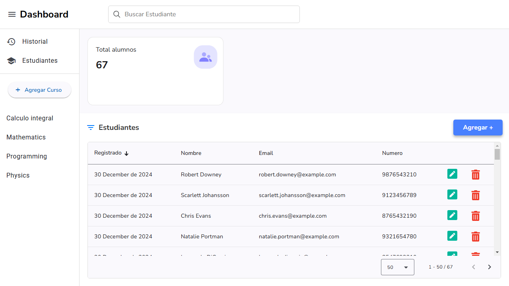
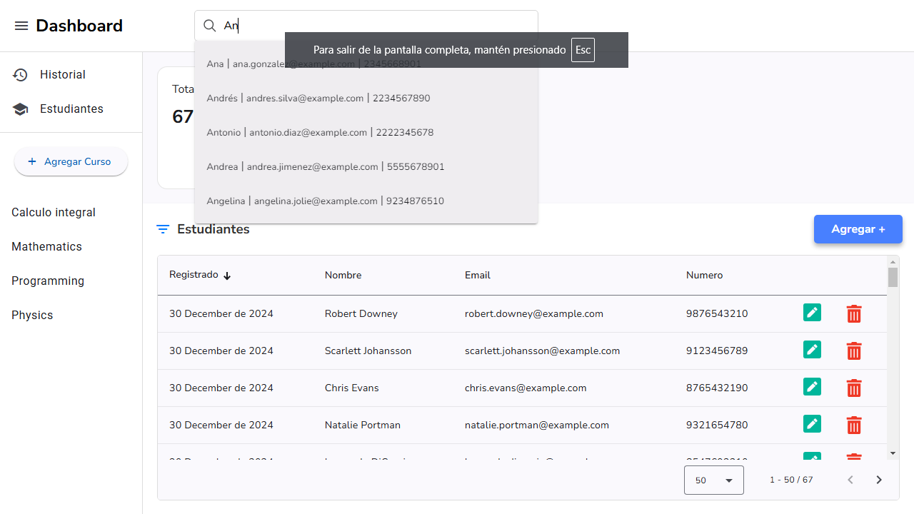
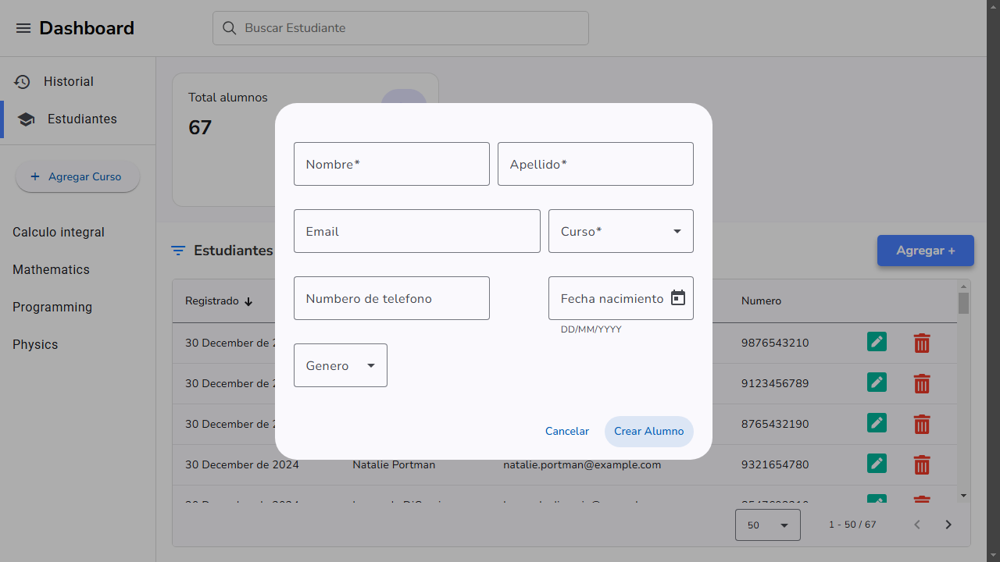
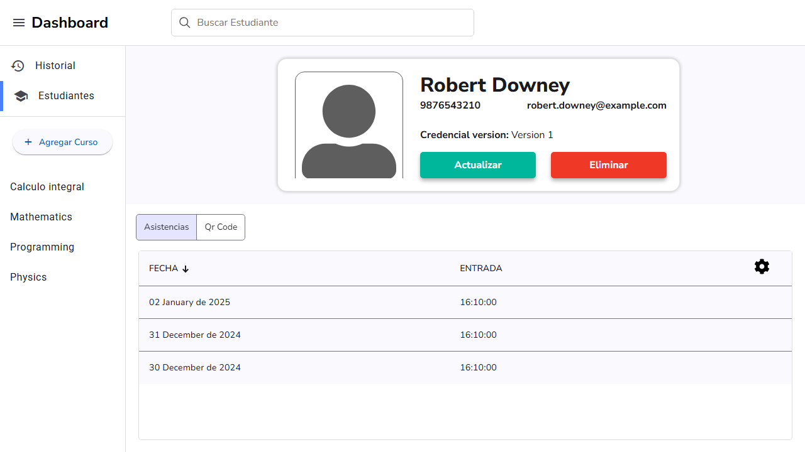
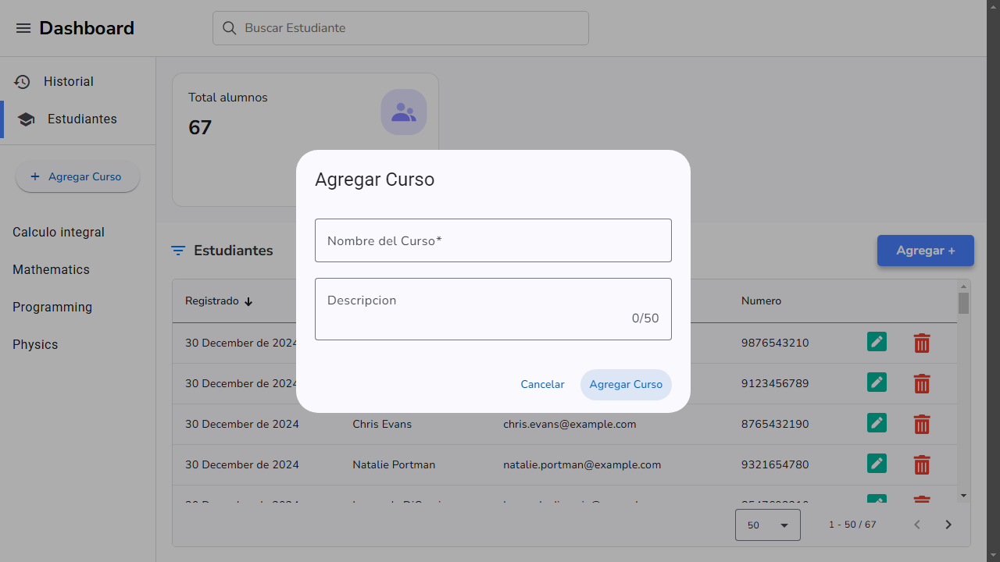
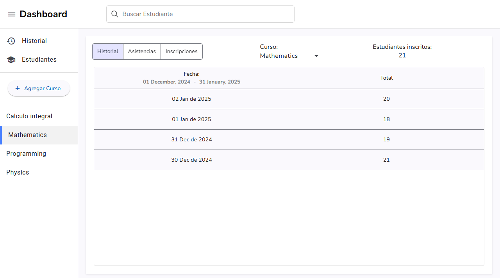
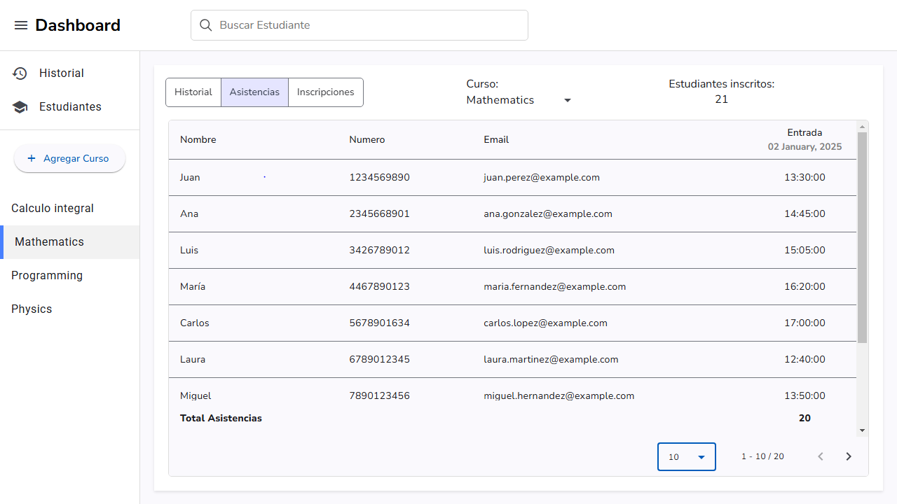

# 🎓 School Management Frontend  

Welcome to the **School Management Frontend** project! This application is built using [Angular CLI](https://github.com/angular/angular-cli) version **18.2.11** to provide a smooth and efficient interface for school management.  

## 🚀 Getting Started  

### ✅ Prerequisites  
**Before running the frontend**, ensure the **backend server** is up and running. You can find the backend repository here:  
🔗 [School Backend App](https://github.com/Joseph-q/SchollBackendApp)  

### 📌 Installation & Setup  

Follow these steps to set up the project:  

1️⃣ **Clone the repository:**  
```sh
git clone https://github.com/Joseph-q/SchoolFrontendApp
```  

2️⃣ **Navigate to the project directory:**  
```sh
cd SchoolFrontendApp
```  

3️⃣ **Install project dependencies:**  
```sh
npm install
```  

4️⃣ **Start the development server:**  
```sh
npm run dev
```  

This will launch the application in **development mode** with real-time updates.  

## 📸 Project Screenshots  

✨ A visual tour of the project's UI and features! ✨  
*(Below are some key screens demonstrating the application's functionality.)*  

---

### 🏠 Admin Dashboard – Manage Students  
📌 **Start Page** – Overview of the application.  
  

📌 **Find Students** – Search and filter student records.  
  

📌 **Student Forms** – Add or edit student details.  
  

📌 **Student Detail** – View detailed information about a student.  
  

---

### 📚 Course Management  
📌 **Add Course** – Create and configure new courses.  
  

📌 **Course History** – Track course details and student enrollments.  
  

📌 **Assistance Tracking** – Monitor student attendance.  
  

---


